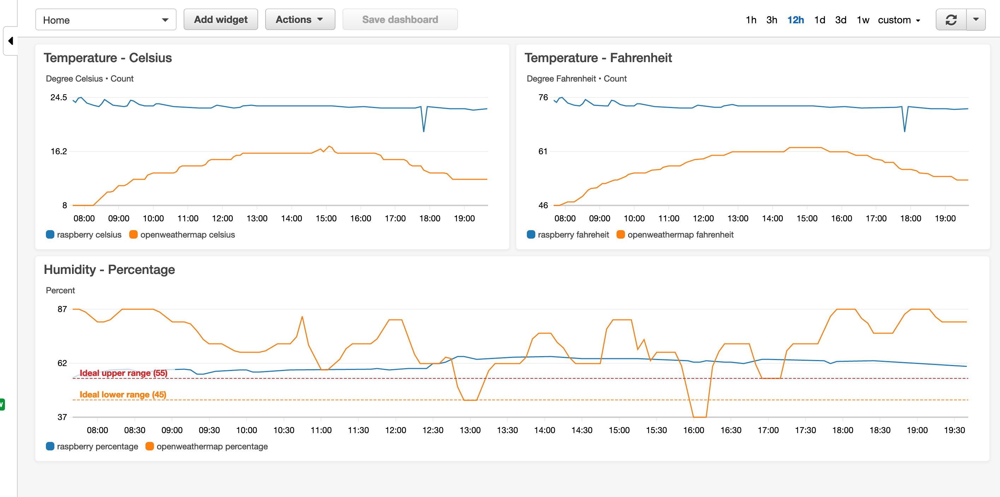

## DHT22 (humidity and temperature) -> Raspberry pi -> AWS IOT

Using [DHT22](https://www.amazon.com/gp/product/B0795F19W6/ref=ppx_yo_dt_b_search_asin_title?ie=UTF8&psc=1) (humidity and temperature sensor) on raspberry pi to collect data and send to AWS IOT

Prerequisites:

sudo apt-get install libgpiod2
raspbian buster

Lambda handler code is at: https://github.com/prabhatsharma/aws-iot-cloudwatch

